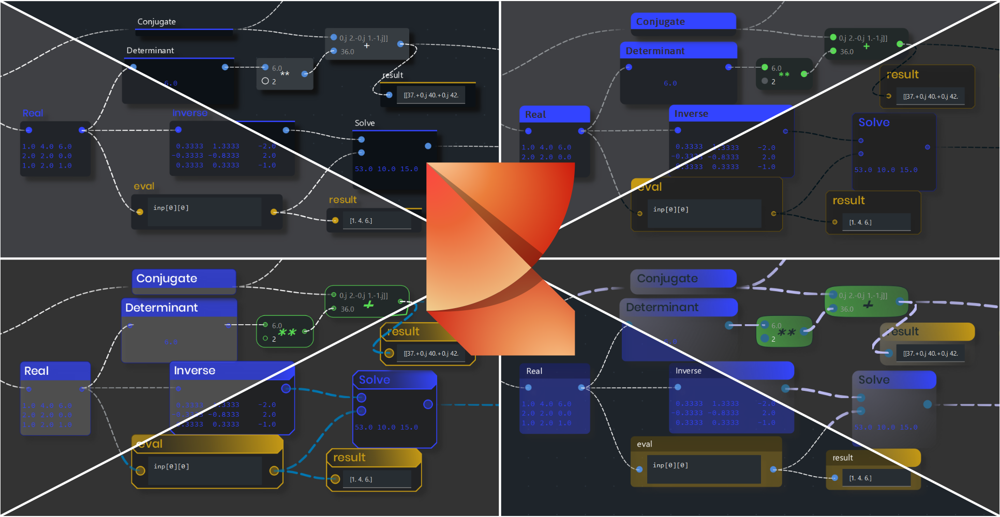
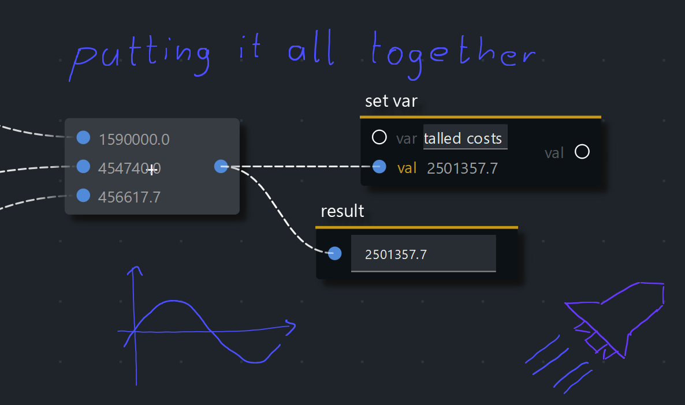

<p align="center">
  
</p>

# A simple visual node editor for Python

**Ryven combines flow-based visual scripting with Python. It gives you absolute freedom for your nodes and a simple system for programming them. While there are some example node packages, you will most likely rely mostly on your own nodes.**



<!-- Ryven is based on [ryvencore](https://github.com/leon-thomm/ryvencore) and [ryvencore-qt](https://github.com/leon-thomm/ryvencore-qt). A detailed guide for Ryven can be found [here](https://ryven.org/guides.html#/). -->

While Ryven has a large Qt-based frontend which affects performance of flow execution, you can disable particularly expensive features, and a project made in the editor can be deployed directly on the backend (ryvencore) via RyvenConsole, which does not have a single dependency!

| Ryven repos on GitHub | -------------------------------------------------------------------------------- |
|---|---|
| [ryvencore](https://github.com/leon-thomm/ryvencore) | backend / core framework |
| [ryvencore-qt](https://github.com/leon-thomm/ryvencore-qt) | Qt frontend |
| [ryven-blender](https://github.com/leon-thomm/ryven-blender) | Ryven plugin for Blender |
| [ryven-unreal](https://github.com/leon-thomm/ryven-unreal) | Ryven plugin for Unreal Engine |
| [ryven-website](https://github.com/leon-thomm/ryven-website) | Ryven website sources |
| [PythonOCC nodes for Ryven](https://github.com/Tanneguydv/Pythonocc-nodes-for-Ryven) | Ryven nodes for PythonOCC |

To get started with Ryven, these are the resources that guide you through the process (in an order that makes the most sense):
1. the quick start guide below
2. the tutorials in the `docs/node_tutorials` directory
3. a longer [guide on the website](https://ryven.org/guide#/) for details

Ryven comes with some example nodes, but these are, indeed, just examples, and there's no guarantee that all of them will stay. I would like to open a repository for maintaining particularly useful (frameworks of) nodes, but I will need contributors for that.

### Installation

```
pip install ryven
```

and now you can launch it by running `ryven` on your terminal, and `ryven_console` for RyvenConsole. If you want to start Ryven from a Python script, just import it and run it like this

```python
import ryven

ryven.run_ryven(
    # args...
)

```

### quick start

A super quick intro to Ryven.

**editor usage**

Open Ryven by typing `ryven` in your terminal (or running `Ryven.py` with python), and create a new project. Import some example nodes via `File -> Import Example Nodes` and select `std/nodes.py`. You should now see a long list of nodes on the left. Drag and drop them into the scene and get a feeling for how they work, everything is being executed at realtime. For instance, drag two `val` nodes into the scene, wire them together with a `+` node and display the result in a `result` node. Now replace one of them with a slider node generating real numbers. You can also get an interactive nodes list preview inside the scene by right-clicking. You can pan around also with the right mouse button, and zoom via `ctrl + scroll`.  You can also create new scripts, rename and delete them.

Now let's check out the small example projects: open a new Ryven window and load one of them. Take a closer look and understand what they do.

At this point you are ready to start building your own nodes.

**defining nodes**

Navigate to the `~/.ryven/packages/` directory and create a new folder `<your_package_name>`. Inside this folder create a python file `nodes.py` and fill it with the following content:

```python
from ryven.NENV import *

# your node definitions go here

export_nodes(
    # list your node classes here, as tuple
)
```

and now you can define your own node classes. Reference the ones you want to expose to Ryven in the `export_nodes` function (for example `export_nodes(MyNode, )` or `export_nodes(Node1, Node2, )`). Let's define two basic nodes:

one which generates random numbers

```python
from random import random

class RandNode(Node):
    """Generates scaled random float values"""
    # the docstring will be shown as tooltip in the editor

    title = 'Rand'  # the display_title is title by default
    tags = ['random', 'numbers']  # for better search
    
    init_inputs = [  # one input
        NodeInputBP(dtype=dtypes.Data(default=1))
        # the dtype will automatically provide a suitable widget
    ]
    init_outputs = [  # and one output
        NodeOutputBP()
    ]
    color = '#fcba03'

    def update_event(self, inp=-1):
        # update first output
        self.set_output_val(0, 
            random() * self.input(0)  # random float between 0 and value at input
        )
```

and another one which prints them

```python
class PrintNode(Node):
    title = 'Print'
    init_inputs = [
        NodeInputBP(),
    ]
    color = '#A9D5EF'

    def update_event(self, inp=-1):
        print(self.input(0))
```

and that's it! Go ahead and import your nodes package in Ryven. Place both in the scene and connect the `Rand` node to your `Print` node.

***

You can do a lot more than shown above. A summary of the main features:

- **many modifiable themes**, including light themes
- **simple and unrestricted nodes system**
- **actions / right-click operations system for nodes**
- **variables system** with update mechanism for nodes that automatically adapt to change of data
- **logging support**
- **rendering flow images**
- **stylus support** for adding handwritten notes / drawings on touch devices
- **exec flow support** like [UnrealEngine BluePrints](https://docs.unrealengine.com/4.26/en-US/ProgrammingAndScripting/Blueprints/)
- **Qt widgets support**

and some examples for those:

#### actions / right-click operations system for nodes
which can be edited through the API at any time.
```python
class MyNode(Node):
    ...

    def a_method(self):
        self.actions['do something'] = {
            'method': self.do_sth,
        }

    # with some method...
    def do_sth(self):
        ...
```

#### Qt widgets
You can add custom Qt widgets for your nodes. Define a `widgets.py` file next to your `nodes.py` with similar structure to `nodes.py`, see the guide for detailed instructions.

`widgets.py`
```python
from ryven.NWENV import *
from qtpy.QtWidgets import QWidget

class SomeMainWidget(MWB, QWidget):
    def __init__(self, params):
        MWB.__init__(self, params)
        QWidget.__init__(self)
    ...

class SomeInputWidget(IWB, QWidget):
    def __init__(self, params):
        IWB.__init__(self, params)
        QWidget.__init__(self)
    ...

export_widgets(
    SomeMainWidget,
    SomeInputWidget,
)
```
`nodes.py`
```python
class MyNode(Node):
    main_widget_class = MyNode_MainWidget
    main_widget_pos = 'below ports'  # alternatively 'between ports'
```

#### stylus support
<p align="center">
  
</p>

#### logging support
```python
import logging

class MyNode(Node):
    def somewhere(self):
        self.logger = self.new_logger('nice log')
    
    def update_event(self, inp=-1):
        self.logger.info('updated!')
```

#### variables system
with an update mechanism to build nodes that automatically adapt to change of data.

```python
class MyNode(Node):
    def a_method(self):
        self.register_var_receiver('x', method=self.process)

    # with some method...
    def process(self, val_of_x):
        # processing new value of var 'x'
        ...
```

## Contributions

Contributing guidelines: [here](https://github.com/leon-thomm/Ryven/blob/dev/CONTRIBUTING.md).

Particularly effective ways to contribute outside direct development of the software include

- creating examples
- creating tutorials
- creating node packages
- improving documentation

Also notice that there's a *discussions* area in this repo.

The docs page on the website is made with [Docsify](https://github.com/docsifyjs/docsify/), so you can improve it by simply editing the markdown. The whole [website sources](https://github.com/leon-thomm/ryven-website) are also on GitHub.

Cheers.
