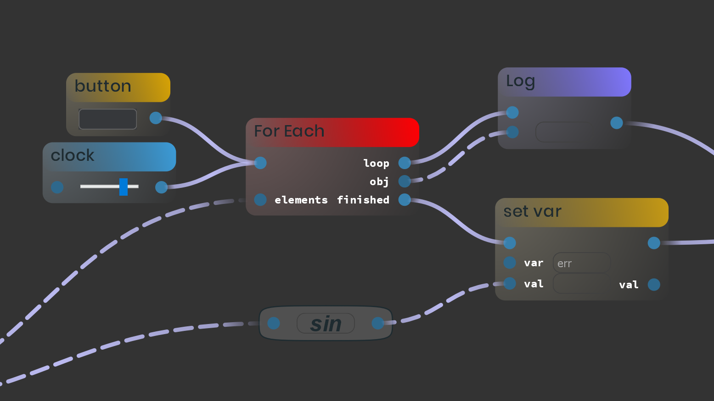

# Welcome to the documentation page of pyScript!

pyScript is a standalone software based on Python and Qt for runtime flow-based visual programming in Python. Please keep in mind that this is not a professional piece of software and it shouldn't be seen like that.
It is currently not yet in a state of large package varieties of usable nodes. One of the most important concepts however is the process of creation of new nodes which is fairly easy while restrictions are kept very low (see 'Creating new nodes'). However if people keep creating new nodes, this might look very different in the future. For now, this is more for vp-enthusiasts who intend to create their nodes themselves.

# Idea

The idea is basically to have a runtime flow-based visual programming environment for Python. The runtime part means that you don't export any code, everything gets executed within the editor as you go, at runtime. Beside the main pyScript application (the editor), the pyScript NodeManager lets you manage your existing and create new nodes which you can then program using any code editor for use in your visual scripts. The focus is on enabling an easy process of creating new nodes and giving them intuitive GUI elements. So you can throw any Python code into these nodes and pyScript provides you with the platform to use them in combination with others. So you should see this as a framework. There are rules but as long as you keep behaving as intended, you can make use of the benefits of the flow-based representation. Keep in mind that the intention is not to 'replace' textual coding - there is very much you can do which doesn't make sense being represented that way at all. But there is also the opposite.

There are two types of connections (execution and data connections) but if you are searching for a pure data flow sofware, you can absolutely do normal pure dataflows which opens plenty of possibilities for data manipulations.

# Getting Started

## Installation

You need to have **Python 3 and PySide2** installed plus all the packages that you may want to use in the nodes. Some example packages are in the 'packages' folder. And you can find example projects in the 'saves' folder that use these packages. **To start the editor simply run _pyScript.py_**. To start the NodeManager run _pyScript NodeManager.py_ in the 'pyScript_NodeManager' folder.

## pyScript Overview

When you open pyScript, you will notice, there are different scripts. Every script has variables and a flow (or 'graph'). You can right click on scripts, variables and many other components to perform actions like 'remove' on them.

### Placing Nodes

Just left click on a flow to see what nodes you can place. You can also press 'Shift'+'P' to place a new node besides the last one and move it around with 'Shift'+Arrow.

### Importing Nodes

You need to import nodes before you can use them from node packages (File -> Import Nodes and then choose a nodes package file *.pypac). If the import succeeded, you will then be able to use the imported nodes in all scripts.

### Zoom

Strg+Mouse Wheel

### Variables

You can create new variables just like scripts. By right clicking on a variable, you can set the value in the dialog that pops up. Whatever you type into that field will be evaluated by Python using the _eval()_ method, so the datatype will automatically be parsed just like when assigning variables in Python source code. To use a variable, you must use the get var node, which returns it's _value_ (without copying it).

[//]: # (As long as your variable does not have a complex tape that will be given by reference when the object is being passed to another node, the original variable's value will not change if you change the value of what's coming out of the get var node. However if the variable does have a referenced type, it will. If you are not sure about that, dont panic, I did not apply any custom operations on the variables in pyScript according to their types, so everything behaves strictly following the rules of Python, nothing else.)

### Load&Save

You can save projects by clicking File -> Save Project. You should do this often. When starting pyScript, you can load such a saved project into the editor. A little dialog will show all the required packages for the project you are trying to load. If you have used packages from special places (not the standard packages folder), you should choose them manually. If not, you can use auto import, it will search through all packages in the standard packages directory.

### Stylus Support

You can use stylus pens for either editing flows aka programming just like normal or to put handwritten notes into your script. In the top right corner, you can spcify that. Be aware, that this feature is not heavily tested, it surely contains some bugs.

### Save Picture

I see a lot of potential for this software at the visualization of algorithms. To support that, you can save pictures of your flow.

#### Viewport Picture
Makes a picture of exactly what you see in the editor.

#### Whole Scene Picture
You also can get a full image of the scene, so you can cut out the parts that you need for use in your presentation for example. The zoom factor determines the resolution.

# Creating New Nodes - Basics

There is a full example at the end of this section.

The overall process looks like this:

- First, you open NodeManager, you can import a package if you want to edit it.
- Then, you do your stuff there (changing names, adding new nodes, specifying their colors - all that kind of stuff)
- You save them by exporting them as a package
- Then you open the package folder with a file browser
- You program the node(s) and their widgets by editing the 'metacode' files
- You open pyScript
- Import the nodes
- And test them

**A node's basic attributes are:**

- Title
- Class name
- Type
- Description
- Use of MainWidget
- DesignStyle
- Color
- Inputs (initial)
- InputWidgets used
- Outputs (initial)

There are a few **name conventions** that you should follow:

- A package's name is unique.
- Multiple Nodes in a package _can_ have the same name.
- No name or title is allowed to have a sequence of three underscore characters '\_\_\_' as this is an anchor for pyScript and the NodeManager for separation of different components.

## NodeManager Overview

This section provides information about the creation of new nodes using the NodeManager. Please be aware that this application is not extremely intuitive just yet, there are quite a few features still missing. I am working on that :)

This is what the NodeManager can look like. To define a node, you first have to specity it's basic properties.

If your node has a title that is not class-or file-/foldername conform (like '%'), you need to give a custom 'Internal Name' which then will be used internally instead of the node's title. Caution! You are not getting warned if your node title is not conform and you try to save your nodes. But that's one feature on my list I will try to implement soon. Your title can have spaces though, the example 'With File Open' automatically becomes 'WithFileOpen' as class name when exporting.

For input widgets like shown in the picture, simply select the widget that you want to use in the drop down menu. You can also program cutom widgets, for that see 'Data Input Widgets' in the next section.

## Updating Packages 

A package is identified by it's name. Packages with the same names should never exist. You can and should choose the original package directory _in the end_. None of your content will be deleted or edited. Source code files get only created if they do not already exist (see next section) and all your custom files and folders you have put somwhere into the package's directory stay as they are.

## Programming Nodes

And there we are. The basic concepts are:

- For every node (as well as all it's widget classes, more on that later), the NodeManager creates **METACODE**-files from templates if they are not already existing. All programming is done by editing these METACODE files.
- pyScript will create the actual source code files every time the package is being imported. These get created in the same locations as the metacode files.
- **Do not edit non-metacode source files directly, as these changes will be lost.**

To start programming a node, simply direct into it's folder in the package directory and open the metacode Python file with a code editor. **I strongly recommend using the Atom editor to program the metacode files**.

If you open the file, you will see something similar to this:

#### Updating Method

Now you just need to put your code into the _updating()_ method. There is only one convention that you need to consider:

If your node has one or more execution inputs, you always need to check for _input_called_. That enables your node having mutliple execution inputs triggering different behaviour. Example:

FOR EACH LOOP WITH BREAK EXAMPLE

If your node does not have any execution inputs, if doesn't matter.

Example for a _+_ node:

        def updating(self, token, input_called=-1):
            sum_val = self.input(0) + self.input(1)
            self.outputs[0].set_val(sum_val)

That's mostly it.

In the case that your node instance executes multiple times the same execution output, like a loop does, see section 'Multiple Output Calls' below.

And don't call _self.updating()_ directly, use instead

    self.update()

That's it. Everything beyond that is the use of special features. There are a few very useful ones but you don't have to use them. If you successfully created a node, I recommend reading 'Special Actions' and 'API'. After that, you can take a look at the more advanced stuff to get a deeper sense of how this framework expects you to behave and what features you can make use of.

## Special Actions

A very handy feature. **The special actions attribute is a dictionary** and holds information about accessible right-click operations which then will automatically be created when right clicking on a node instance. A possible entry would be

            self.special_actions['print something'] = {'method': self.action_print_something}

In this case, a method _action_print_something_ would need to exist

        def action_print_something(self):
            print('Hello World!')

This would look in pyScript like that:

## API

To access the node's contents there is a small 'API' that you can use in the class.

### Logging

You can log mesasges to the script's logs via

    self.log_message(message: str, target='global')

_target_ can be _global_ or _error_ which addresses the global messages log or the error log.

A node can also request new logs using

    self.new_log(title: str)

One node can hold mutliple personal logs. When using logs, don't forget to add

    mylog.remove()

for every log in the _removing()_ method. This will cause the log widget in the script's logging area to change appearance.

### Shape

You can cause a manual recomputation of the shape of the node including the positions of all contents using the

    self.update_shape()

command. You normally shouldn't need to use this.

### Ports (for nodes with dynamic behaviour)

Adding a new input port:

    self.create_new_input(type_: str, label: str, widget_type='', widget_name='', widget_pos='under', pos=-1)

- _type\__ refers to the input's type ('exec' or 'data')
- _label_ is the shown name of the port
after these two I recommend only using unpositional identifiers
- _pos=-1_ means, the input will be appended at the end, everything else specifies the index at which the input will be inserted
All widget related arguments are only important for data inputs:
- The _widget_type_ is the type of the input widget that will be created. Possible values are:
    - 'std line edit'
    - 'std spin box'
    - 'custom'
    - I am planning to add a whole bunch of more pre-defined standard widgets soon...
- If _widget_type_ is 'custom', you must give a _widget_name_ which must refer to an already programmed input widget.
- _widget_pos_ determines whether the input widget will be 'besides' or 'under' the the Port

Adding a new output port:

    self.create_new_output(type_, label, pos=-1)

see 'Adding a new input port'.

Deleting input port:

    self.delete_input(index)

Deleting output port:

    self.delete_output(index)

Renaming input port:

    ...

Renaming output port:

    ...

## Debugging

If you are troubleshooting your nodes, you can turn debugging on. This will print a lot of information in the output window including the following error message
        
        EXCEPTION IN <NodeInstance Name> NI: <exception>
        
whenever the execution of a node returned an error. That is a very useful feature but one of the things I have to work on most importantly since this is not very intuitive just yet.

# Creating New Nodes - Advanced

## Nodes With States

If your node has states, you _can_ save these state defining attributes by providing their values in the _get_data()_ method and reloading them in the _set_data()_ method to make sure that the node's state gets reinitialized correctly when loading a project for example. You don't have to do this though. But if your node's behaviour can be slightly adapted by the user, it often makes sense to save it. Just provide all state defining attribute values **in JSON compatible format** in the _get_data()_ method. Then do the opposite in the _set_data()_ method. _get_data()_ is also called when nodes are copied and _set_data()_ when they are pasted.

If everything that happens is dependent on what is being triggered (like an execution input) and not on any internal variables, then you don't have to do anything here.

All inputs and outputs get saved and reloaded automatically as they are, so if you added some or removed some, you don't have to worry about that in _get_data()_, _set_data()_, you just need to reset your intern variables telling your class in which state the node is currently in.

This applies on the normal node class as well as on all the widgets classes, these have _get_data()_ and _set_data()_ too.

## Threading And Timers

The _removing()_ method is being called when a node gets removed from the flow. This is only important for node instances that autonomously run independent computations like threads or timers. These should all be stopped in this method.

This applies on the normal node class as well as on all the widgets classes, these have _removing()_ too.

## Programming Widgets

The possibility to program custom widgets for the nodes is one of the core concepts. A node instance can have a main widget which sits either between or under the ports, and every data input of a node instance can have a widget too. All widget classes must be stated in the NodeManager (whether it has a main widget and every custom input widget in the 'Input Widgets' area). When saving the node in a package, the NodeManager will then create template files (_METACODE_) for all these widgets, just like for the node intance class. To program the widgets, simply edit these metacode files. A widget is a QWidget. So you need to know, how to program Qt code which is why I won't cover that in detail. If you are not familiar with Qt but you have already worked with other GUI libraries, getting into PySide2 (aka 'Qt for Python') is not very difficult I guess. If you didn't, ignore that feature and just use standard widgets.

### Access Parent Node Instance

In both types of widgets, you can access the parent node instance via

> self.parent_node_instance

### Main Widget

The metacode for a main widget looks somehow like this:

    from PySide2.QtWidgets import ...
    # from PySide2.QtCore import ...
    # from PySide2.QtGui import ...

    import os

    class %NODE_TITLE%_NodeInstance_MainWidget(...):
        def __init__(self, parent_node_instance):
            super(%NODE_TITLE%_NodeInstance_MainWidget, self).__init__()

            # leave these lines ------------------------------
            self.parent_node_instance = parent_node_instance
            self.package_path = os.path.join(os.path.dirname(os.path.abspath(__file__)), '../../../')
            # ------------------------------------------------

            self.setStyleSheet('''

            ''')

            # ...

        def get_data(self):
            data = {}
            # ...
            return data

        def set_data(self, data):
            pass

        # optional - important for threading - stop everything here
        def removing(self):
            pass

You can either let the class derive directly from QWidget (just import it in the first line and put it in the parantheses behind the class name), or from a specified one like QLineEdit (same process).

#### Using Custom Content - Package Path

As you can see there is a package path which is the path to the package the node instance is a part of. This is very useful if you want to use resources laying on your file system, images for example. You can put them anywhere you want into the package directory, they will not be removed by the NodeManager when overwriting the package.

#### Minimal Example

The following code is an example for a button node. Once you press the button, the first and only execution output should get executed. Because all the connecting is done in the node instance class, this is pretty simple:

    from PySide2.QtWidgets import QPushButton

    class %NODE_TITLE%_NodeInstance_MainWidget(QPushButton):
        def __init__(self, parent_node_instance):
            super(%NODE_TITLE%_NodeInstance_MainWidget, self).__init__()

            # leave these lines ------------------------------
            self.parent_node_instance = parent_node_instance
            # ------------------------------------------------
            self.setStyleSheet('''
                background-color: #36383B;
                padding-top: 5px;
                padding-bottom: 5px;
                padding-left: 22px;
                padding-right: 22px;
                border: 1px solid #666666;
                border-radius: 5px;
            ''')
            
        # get_data, set_data and removing stay empty as there are no states or timers

In the node instance class, we need to connect this button like that:

    # ...

    class %NODE_TITLE%_NodeInstance(NodeInstance):
        def __init__(self, parent_node: Node, flow, configuration=None):
            super(%NODE_TITLE%_NodeInstance, self).__init__(parent_node, flow, configuration)

            self.main_widget.clicked.connect(self.button_clicked)  # Qt syntax

            if configuration:
                self.set_data(configuration['state data'])

        def button_clicked(self):
            self.update()  # always call self.update(), never self.updating() directly

        def updating(self, token, input_called=-1):
            self.exec_output(0)

    # ...

### Data Input Widgets

Input widgets are custom widgets you can program for input ports of the node.

- Custom input widget names must be unique _inside the same node_. Other nodes can have same custom input widget names.

There are standard widgets for data inputs which you can select in the NodeManager for the pre defined ports, or you can also use them when programatically adding new inputs (see section 'Ports' above). But you can also program custom widgets for inputs.

When using custom input widgets, you must define them in the 'Input Widgets' area and give the exact name in the 'input widget name' line edit of the input you want to have this widget. Multiple inputs can have the same custom widget. The 'Yes' and 'No' radio buttons specify whether your input has a widget at all or not. Execution inputs do not have custom widgets, so then you can ignore the whole widgets part of the input's widget in the 'Inputs' field.

After you stated the existence of the custom input widget in the NodeManager and saved the node in a package, the metacode files that you can edit should be in the 'widgets' folder of you node. Programming a custom widget does not differ from programming a main widget at all.

The only difference is, that you need to fill the _get_val()_ method which should return the value that the widget represents _if_ the input the widget is a part of is not connected to some other node instance.

## Multiple Output Calls

The For Each Loops's _updating()_ method should look like this:

        def updating(self, token, input_called=-1):
            if input_called == 0:                # activated
                for obj in self.input(1):
                    self.handle_token(None)      # creates a new token
                    self.outputs[1].set_val(obj) # setting an output value - not important here
                    self.exec_output(0)          # executing loop output

                self.handle_token(token)         # reset to the original token
                self.exec_output(2)              # execute 'finished' output

This might change soon. But I'm not sure yet.

## Full Example

Because getting into this without a full example is a bit hard at first, here I take you through the process of creating an example node using all standard features.

Let's build a node, that generates random 2D points and returns them as array. So first, let's configurate the node in NodeManager:

The title 'Points Field' can be converted into the valid class name 'PointsField', so that we can leave. The type is 'points', so the user will be able to find that node by searching for the type (once I implemented that ;)  ). Then, I added a little description. The node also has a main widget which sits under the ports where we will draw the points. Furthermore, I want it to be able to deliver the points in absolute scale as well as in relative. In absolute scale, the coordinates are given according to the widget'S size (200x200 pixels), in relative mode the coordinates are scaled to 0-1. And that should be able to be controlled through a data input. That way we could later connect that to an extern node output of another node. A check box would be the most reasonable representation as widget. So the existence of this custom input widget is stated in the 'Input Widgets' field with the name 'RelativeCoordinates_IW'. The node has three static inputs, one execution input to trigger the randomization, one for the number of points and the one specifying the scale of the coordinates. Is also has an exec output which should be executed after the 'randomize' input has been triggered and a data output where we will make the array of generated points accessible.

So, let's save this in a package called 'points example'.

Now, let's program the node _instance_ class. Navigate to the 'points example/nodes' folder where you should find a folder called _points example\_\_\_PointsField0_. In this folder, you should find the metacode file for the node instance _points example\_\_\_PointsField0\_\_\_METACODE.py_. In the widgets folder, you should find the metacode file for the custom input widget _points example\_\_\_PointsField0\_\_\_RelativeCoordinates_IW\_\_\_METACODE.py_ as well as the main widget _points example\_\_\_PointsField0\_\_\_main_widget\_\_\_METACODE.py_.

First, open the node instance file.

    def get_data(self):
        data = {}
        return data

    def set_data(self, data):
        pass

We will store the points in the main widget (which also is meant to show them), not in the node instance. Otherwise we would constantly have to keep both attributes sychnonous which is unnecessary here. That means, the node instance also does not have to do anything in _get_data()_ and _set_data()_ since the the points are not saved here.

    # optional - important for threading - stop everything here
    def removing(self):
        pass

We also have no running threads or timers, so _removing()_ stays empty too.

All we have to do is to define the update method.

    def updating(self, token, input_called=-1):
        if input_called == 0:
            new_points = self.main_widget.randomize(self.input(1), self.input(2))
            self.set_output_val(1, new_points)
            self.exec_output(0)

Input 0 is the 'randomize' execution input, so we need to check for it. If the signal comes from input 0 (_input_called == 0_), we want our main widget to generate new points. We will do that with a _randomize()_ method which we will later implement in the main widget. It needs to know how many points and in which scale, so we give the number (input 1) as well as the scale (input 2) as parameters. Input 1 will return a number if it's not connected since we chose a spin box widget for that one. Input 2 will return a bool, because we are going to implement a check box for that one shortly. Then we need to store the points array at output 1 and execute output 0 to pass the signal to the next connected node instance.

Now, it would be cool, if we could manually cause a randomization via a right click action. Fortunately we don't have to do anything for that because all execution inputs of a node instance are always manually via right click action executable - pyScript will add that action automatically.

Let's implement the check box input that specifies in which scale the points should be delivered. We want it to be a check box for which the QCheckBox class from Qt (PySide2) is perfect. So we need to import it

    from PySide2.QtWidgets import QCheckBox

and make the class derive from it

    class %INPUT_WIDGET_TITLE%_PortInstanceWidget(QCheckBox):

Now we need to ensure that the value will be returned when requested

    def get_val(self):
        # QCheckBox.isChecked() is a method of the QCheckBox class, see Qt documentation
        return self.isChecked()  # will return a boolb

And we have to store the current value (whether the check box is checked or not; there is nothing else that defines the current state in that widget) and reload it when necessary

    def get_data(self):
        data = {'checked': self.isChecked()}
        return data

    def set_data(self, data):
        # QCheckBox.setChecked() is a method of the QCheckBox class, see Qt documentation
        self.setChecked(data['checked'])

Now, the only thing left to do is to program the main widget. The widget should show points and I would do that with a QPixmap on a QLabel. Instead of making the main widget a QLabel directly, I will make it a QWidget. That way it will be easier to add more UI elements later that define how points are generated if I want to. 

    from PySide2.QtCore import Qt  # gives us easy accessible pre-defined colors etc.
    from PySide2.QtGui import QPixmap, QPainter, QPen, QColor, QBrush

    from PySide2.QtWidgets import QWidget, QVBoxLayout, QLabel

    import random

For the generation of the random coordinates, we need Python's _random_ module.

    def __init__(self, parent_node_instance):
        super(%NODE_TITLE%_NodeInstance_MainWidget, self).__init__()

        # leave these lines ------------------------------
        self.parent_node_instance = parent_node_instance
        # ------------------------------------------------
        self.setStyleSheet('''
            QWidget {
                background-color: #333333;
            }
        ''')

        self.setLayout(QVBoxLayout())  # creating a layout - the widget must have one so that we can add stuff on top of it
        self.label = QLabel()  # creating a label for the pixmap to sit on
        pix = QPixmap(200,200)
        self.label.setPixmap(pix)
        self.layout().addWidget(self.label)  # adding the label with the pixmap to the layout
        self.resize(200, 200)

        self.points = []

In the constructor, we give a stylesheet to make it look nice, setup the whole UI and the points array. To make sure, we don't forget that, let's fill _set_data()_ and _get_data()_ first:

    def get_data(self):
        return {'points': self.points}

    def set_data(self, data):
        self.points = data['points']
        self.draw_points(self.points)  # will redraw all the points - see below

The _removing()_ method of course again stays empty; no threads, no timers running.

Two things left:

- First: implement the _randomization()_ method we called from the node instance class
- And Secondly: display the points

Randomization method:

    def randomize(self, num_points, relative_scale):
        self.points.clear()

        for i in range(num_points):
            x = random.uniform(0, 1)
            y = random.uniform(0, 1)
            if not relative_scale:
                x *= 200
                y *= 200
            self.points.append({'x': x, 'y': y})

        self.draw_points(self.points, 1 if not relative_scale else 200)

        return self.points

Drawing points:

    def draw_points(self, points, mult):
        painter = QPainter(self.label.pixmap())  # initialize the painter with the pixmap, we want to draw on, so it will paint on that pixmap
        painter.setRenderHint(QPainter.Antialiasing)  # turn antialiasing on to make it look smooth

        painter.setPen(QPen('#333333'))  # set a pen color
        painter.setBrush(QColor('#333333'))  # same for 'brush'
        painter.drawRect(self.rect())  # the pixmap cannot have a transparent background, so we need to draw it's background manually with the background color of the widget (see style sheet above)

        pen = QPen(QColor(255, 255, 255))  # set pen color white
        painter.setPen(pen)
        painter.setBrush(QBrush(Qt.white))  # brush also white (fills the circle)

        for p in points:  # draw every point
            painter.drawEllipse(p['x']*mult, p['y']*mult, 4, 4)
        
        self.repaint()  # tells the flow to update because something has changed; otherwise we may not see a change

And that's it!

Now we can import that new package into pyFlow and start using the node!

# Advanced

## Tokens

A so-called _token_ is created when an execution 'impulse' is created. It tells the node instance receiving an update event call whether the script is still executing the same execution string.

The + node instance does not have to update again when the set var b node instance causes a request for the output value through the / node instance, because the + already updated when the set var a node instance requested data. That is a performance measure. It might seem a little overpowered but if this + node instance would depend on a few other passive node instances which themselves depend on event more passive node instances, we would run very quickly into serious performance issues.

I'm actually proud of that. I just got the idea very spontaniously one sunday morning and for my conditions this is working way too well :)

## Storing Data In Actions

You probably will not need this, so don't let yourself get confused if you didn't search for it.

Only if you want to create very dynamic nodes with multiple right click operations representing the same action but for different inputs while having a dynamic number of these inputs - then you will definately run into this, so I had to come up with a solution.

When you have multiple entries in _special_actions_ that point to the same method like that:

        self.special_actions = {'delete input 1': {'method' : self.action_delete_input},
                                'delete input 2': {'method' : self.action_delete_input}}

because the user added an input through another action for example, then how can we determine in the _delete_input_ method which action was pressed?

The solution is another attribute in the action's object in the _special_actions_ dict:

        self.special_actions = {'delete input 1': {'method' : self.action_delete_input,
                                                   'data' : {'input number' : 1}},
                                'delete input 2': {'method' : self.action_delete_input},
                                                   'data' : {'input number' : 2}}

and the extension of the _delete_input_ method by a _data_ parameter

    def action_delete_input(self, data):
        input_number = data['input number']

Full example following soon...

## Updating Algorithm

Assuming the If node received a signal at input 0 (execution) - maybe by the richtig click actions menu by the user - this is what happens here:

> 1. The the If's _updating()_ method is being called with _input_called_ == 0
> 2. The If's _input(1)_ method is called because the If needs the data from this input to continue
> 3. The If's second input sees that it is connected (the user could also type something directly into the input widget), so it requestes the data from the output of the ==
> 4. The =='s _updating()_ method is called with _input_called_ == -1
> 5. The == calls self.input(0)
> 6. The =='s first input port has no connections, so it returns what is typed into the input witget (the number 1)
> 7. The == calls self.input(1)
> 8. The =='s second input port returns 2
> 9. The == sets it's output port's value to 3 and returns
> 10. The =='s output port returns
> 11. The If's second input port returns 2
> 12. The If executes output 1 (second output)
> 13. The Print B's _updating()_ method is called with _input_called_ == 0
> 14. The Print calls self.input(1)
> 15. The Print's second input requests data from the =='s output
> 16. The =='s output sees, that it already updated in this execution task, so it instantly returns 3
> 17. The Print's second input returns 3
> 18. The Print prints 3

_updating()_ gets called every time, the node received a signal. It is important, that the parameter _input_called_ specifies the input of the node that received a signal. This value can be -1 if the node updated itself normally because the value of a data _output_ was requested by another node and it has not been set yet in the current execution of the script.