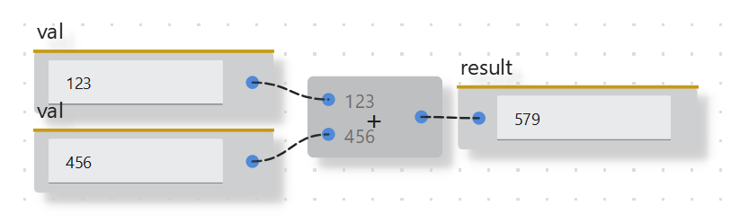

This tutorial shows how to create nodes for some basic operations/relations, in particular **arithmetic operations**, **logic operations**, and **value comparisons**. The full nodes package is part of the `std` package, see `ryven/example_nodes/std/basic_operators.py`.

As always, we should first define a parent node class for this scope. It can be completely empty, but it's good practice to always include it as this prevents node identification issues which might occur in complex hierarchies in case you add it later.

```python
from ryven.NENV import *

class NodeBase(Node):

    version = 'v0.1'
    
    # most of our operators are binary, so let's already put this here (we can override that in subclasses for the exceptions)
    init_inputs = [
        NodeInputBP(dtype=dtypes.Data(size='s')),
        NodeInputBP(dtype=dtypes.Data(size='s')),
    ]
    # operators in python can be defined on objects of different classes, so let's just use Data dtype inputs for now. recall that Data inputs will evaluate input expressions (as opposed to just interpreting it as string for example)
    
    init_outputs = [
        NodeOutputBP(),
    ]
    
    style = 'small'
```

Let's leave it like this just for now, we can later extend this class. A simple node definition for addition can now look just like this

```python
class PlusNode(NodeBase):

    title = '+'
    version = 'v0.1'

    def update_event(self, inp=-1):
        # adding the first two inputs and pushing the sum to the output
        self.set_output_val(0, self.input(0) + self.input(1))
```

That was easy, no? If we export this node

```python
export_nodes(
    PlusNode,
)
```

we can see it's working as expected



We can make all the other nodes exactly the same way. However, there is one improvement that might be really useful, which is a dynamic number of inputs for chaining the operation (`a/b/c` becomes `(a/b)/c`). Notice that so far the implementation above is of *combinational* type, so the node does not have any states. Hence, there's no need to preserve and rebuild the state, which makes it simple. This will change now, as the semantics of the node depends on the number of inputs.

As this is useful for all our nodes, let's put all this into our `NodeBase` class

```python
class NodeBase(Node):

    version = 'v0.1'

    init_inputs = [
        NodeInputBP(dtype=dtypes.Data(size='s')),
        NodeInputBP(dtype=dtypes.Data(size='s')),
    ]

    init_outputs = [
        NodeOutputBP(),
    ]

    style = 'small'

    def __init__(self, params):
        super().__init__(params)

        self.num_inputs = 2

        # we will use actions (right-click operations) for adding and removing nodes
        self.actions['add input'] = {'method': self.add_inp}

    def add_inp(self):
        """appends a new input"""
        self.create_input_dt(
            dtype=dtypes.Data(size='s')
        )
        self.num_inputs += 1

        # now that some input was added manually, it should be removable again
        self.actions['remove input'] = {'method': self.rem_inp}

    def rem_inp(self):
        """removes the last input"""
        self.delete_input(-1)
        self.num_inputs -= 1

        # we need at least two inputs
        if self.num_inputs == 2:
            del self.actions['remove input']

    # now we need to define storage and reload of the state
    # the state is internally defined only by the value of self.num_inputs
    # notice that the actual inputs themselves are stored and reloaded automatically by Ryven,
    # so we only need to store our own variables

    def get_state(self) -> dict:
        return {
            'num inputs': self.num_inputs,
        }

    def set_state(self, data: dict, version):
        self.num_inputs = data['num inputs']
```

To make the implementations less repetitive, let's also abstract away the `update_event`:

```python
    def update_event(self, inp=-1):
        self.set_output_val(0, self.apply_op(
            [self.input(i) for i in range(self.num_inputs)]
        ))

    def apply_op(self, values: list):
        pass
```

Now subclasses only need to implement this `apply_op` method which gets a list of values with variable length. Our `PlusNode` now looks like this:

```python

class PlusNode(NodeBase):
    """performs addition of all inputs and returns the sum"""

    title = '+'
    version = 'v0.1'

    def apply_op(self, values: list):
        res = values[0]
        for v in values[1:]:
            res = res + v
        return res
```

And that's it. All the other operators can be defined the same way.

```python
class ANDNode(NodeBase):
    """logically ANDs all inputs"""

    title = 'AND'
    version = 'v0.1'

    def apply_op(self, values: list):
        res = values[0]
        for v in values[1:]:
            res = res and v
        return res
```

Notice that this implementation is not exactly performant, it rather serves as example for making nodes generally.
